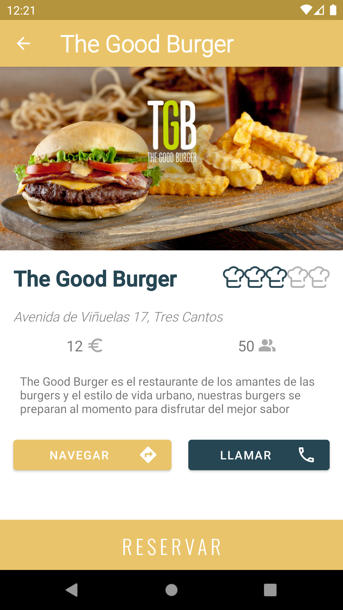

  

  <h3 align="center">SafeBar</h3>

  

    Una aplicación de reservas adaptada a la nueva normalidad
  

## Tabla de contenidos

- [Descripción del proyecto](#descripción-del-proyecto)
- [Participantes](#participantes)
- [Capturas de pantalla](#capturas-de-pantalla)
- [Librerías usadas](#librerías-usadas)
- [Licencia](#licencia)

## Descripción del proyecto

El proyecto surgió por la pandemia en la que vivimos actualmente, pensamos en una aplicación que pudiese ayudar al sector de la restauración que se estaba viendo tan afectado y a la vez ayudar a usuarios a sentirse seguros a la hora de comer en sitios que se encontrasen adaptados a esta nueva normalidad.

## Participantes

*SafeBar es un proyecto desarrollado por los alumnos de DAM de la Universidad Europea:* 
- [@alxgarci](https://github.com/alxgarci)
- [@PabloSC900](https://github.com/PabloSC900)
- @ccapu

## Capturas de pantalla

La aplicación tiene dos 'partes', una de ellas es para el [usuario](#parte-de-usuario) y otra para el [restaurante](#parte-de-restaurante) o establecimiento.

### LogIn y SignUp

  

- ***Splash***: es el primer Activity que se muestra cada vez que se inicia la aplicación. Si no hemos checkeado el *Mantenerme logueado*, si es la primera vez que entramos a la App o si hemos dado a *LogOut* nos llevará al ***LogIn***, en caso contrario nos llevará a la pestaña de *Inicio* o *Reservas Restaurante* en función de la sesión en la que estábamos.
- ***LogIn***: tenemos un switch donde podemos seleccionar para iniciar sesión como [usuario](#parte-de-usuario) o como [restaurante](#parte-de-restaurante). Mediante el *checkBox* podemos recordar nuestra sesión o eliminarla cuando se cierra la App.
- ***SignUp***: podemos registrarnos tanto desde la parte de usuario como de la de restaurante. Ambas partes nos llevarán a la parte de editar perfil para poder completar nuestra información antes de empezar a usar la app.

### Parte de usuario

       

Por la parte del usuario nos encontramos con la pestaña de ***Inicio***, donde cargarán los restaurantes registrados con sus correspondientes datos e imágenes.

  

       

Si entramos en cualquiera de los restaurantes ubicados en cada *CardView*, podremos entrar a lo que sería el ***restaurante*** con su valoración otorgada, la dirección y dos botones, para comunicarse con el restaurante o para abrir *Google Maps* con la dirección de éste. 

       

	
	

En la parte de ***Reservas*** nos encontramos todas las reservas realizadas por el usuario, donde si pulsamos en una nos llevará a la pestaña de ***QR*** y podremos generar nuestro QR para que pueda ser verificado por la parte del restaurante

   

  

El resto de pestañas que podemos encontrar por la parte de usuario son:
- ***Búsqueda***: donde podemos encontrar los restaurantes por nombre y si pinchamos tendría la misma respuesta que en *Inicio*.
- ***Booking (Reserva)***: donde se realiza la selección de hora y fecha para realizar la reserva.
- ***Configuración***: donde encontramos todos los datos de nuestra cuenta, el botón de LogOut y podemos ir a Editar nuestro perfil.

### Parte de restaurante

 

  

En el lado del restaurante nos encontramos con:

- ***Perfil***: donde se encuentra toda la información del restaurante, podemos pasar a la pestaña *Editar* mediante el lapicero del AppBar.
- ***Reservas***: nos encontramos también con una pestaña de reservas, parecida a la del usuario, donde se ven las reservas realizadas al restaurante con el nombre de la persona que reserva, fecha y personas. Accedemos a *Verificar QR* pulsando en cada una de ellas.
- ***Verificar QR***: pulsando en verificar accedemos al Scanner de QR, que devuelve el código de la reserva escaneada en el móvil del usuario y elimina la reserva al pulsar el botón verificar, actualizándose tanto en la parte del usuario como en el restaurante.

## Librerias usadas

En el desarrollo de la aplicación se han utilizado tanto librerias de Android o Google como algunas desarrolladas por usuarios de GitHub.
Se incluyen en el proyecto:
- [Firebase *de Google*](https://firebase.google.com/)
- [MaterialComponents *de Google*](https://material.io/components)
- [Glide *de bumptech*](https://github.com/bumptech/glide)
- [GlideTransformations *de wasabeef*](https://github.com/wasabeef/glide-transformations)
- [ZXing decoder *de journeyapps & ZXing*](https://github.com/journeyapps/zxing-android-embedded)
- [MaterialDateTimePicker *de wdullaer*](https://github.com/wdullaer/MaterialDateTimePicker)

## Licencia

[GNU GENERAL PUBLIC LICENSE](https://github.com/2DAMUE/pfcjun21-safebar/blob/documentacion/LICENSE)

